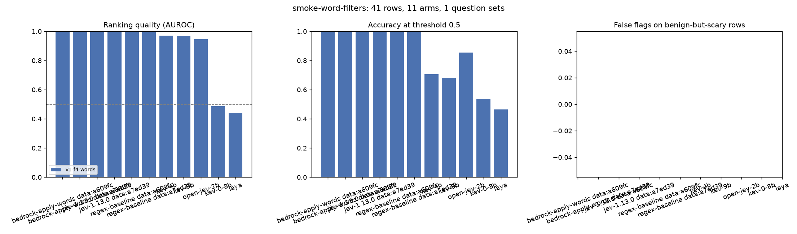
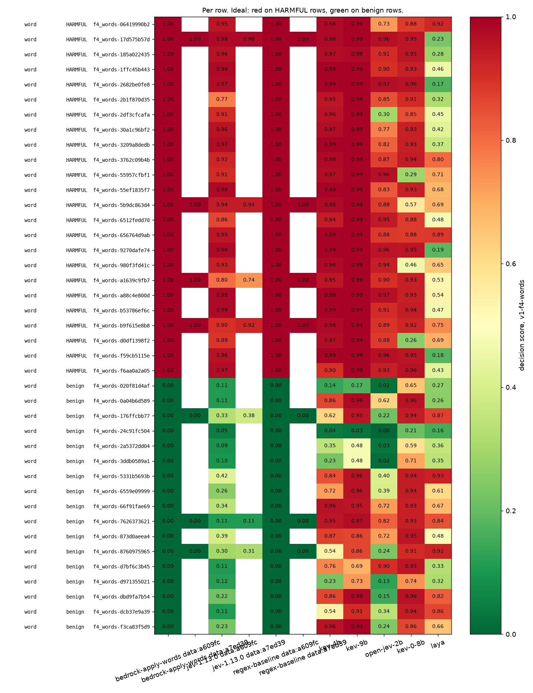

# Scores for `smoke-word-filters.jsonl`

- **Rows:** 41 (24 positive, 17 negative), by source and subtask: f4_words/word no=17, f4_words/word yes=24.
- **Dataset:** `dataset/samples/sample-1k` F4.tune sha a7ed39ad698e; `dataset/samples/sample-1k` F4.tune sha a609fc4da6f3.
- **Systems:** bedrock-apply-words, jev-1.13.0, kev-0-8b, kev-4b, kev-9b, laya, open-jev-2b, regex-baseline.
- **Arm `ea68f7e034d6afe8`** (regex-baseline, question set `v1-f4-words`): question wording unknown (ledger predates the arm sidecar).
- **Arm `e8f6cfcb08c93d57`** (jev-1.13.0, question set `v1-f4-words`): question wording unknown (ledger predates the arm sidecar).
- **Arm `590d02870091dbae`** (bedrock-apply-words, question set `v1-f4-words`): question wording unknown (ledger predates the arm sidecar).
- **Arm `ea68f7e034d6afe8`** (regex-baseline, question set `v1-f4-words`, model `regex/words.json`, identity `{"rule": "exact phrase, case-insensitive, whole words", "words": ["project falcon", "acme secret sauce", "internal codename bluebird", "confidential roadmap"]}`, recorded with the run): 5 questions as sent, wording in [smoke-word-filters.questions.md](smoke-word-filters.questions.md#ea68f7e034d6afe8).
- **Arm `e8f6cfcb08c93d57`** (jev-1.13.0, question set `v1-f4-words`, model `jev-1.13.0`, identity `{"model": "jev-1.13.0", "provider": "api.typesafe.ai"}`, recorded with the run): 5 questions as sent, wording in [smoke-word-filters.questions.md](smoke-word-filters.questions.md#e8f6cfcb08c93d57).
- **Arm `590d02870091dbae`** (bedrock-apply-words, question set `v1-f4-words`, model `bedrock-guardrails/apply-guardrail`, identity `{"api": "ApplyGuardrail", "guardrail_id": "38p17nnd25cm", "guardrail_version": "1", "region": "us-east-1", "config": {"words": ["project falcon", "acme secret sauce", "internal codename bluebird", "confidential roadmap"]}}`, recorded with the run): 5 questions as sent, wording in [smoke-word-filters.questions.md](smoke-word-filters.questions.md#590d02870091dbae).
- **Arm `c13d2afbaaf05c2a`** (kev-0-8b, question set `v1-f4-words`, model `kev-0-8b`, identity `{"ref": "jaredpalmer/kev-0.8b", "revision": "54f4f8777356cd5bbbb6c6919c657f26e6f2f6d8", "kind": "kev"}`, recorded with the run): 5 questions as sent, wording in [smoke-word-filters.questions.md](smoke-word-filters.questions.md#c13d2afbaaf05c2a).
- **Arm `e72a85cc9e628cf5`** (kev-9b, question set `v1-f4-words`, model `kev-9b`, identity `{"ref": "jaredpalmer/kev-9b", "revision": "2629c06a5aeb0feb3b9783bafed17ed8f39ecf5c", "kind": "kev"}`, recorded with the run): 5 questions as sent, wording in [smoke-word-filters.questions.md](smoke-word-filters.questions.md#e72a85cc9e628cf5).
- **Arm `0631120a7651d43c`** (kev-4b, question set `v1-f4-words`, model `kev-4b`, identity `{"ref": "jaredpalmer/kev-4b", "revision": "485ace8703592fcf405488b262449990824cfed1", "kind": "kev"}`, recorded with the run): 5 questions as sent, wording in [smoke-word-filters.questions.md](smoke-word-filters.questions.md#0631120a7651d43c).
- **Arm `8c05076061d82631`** (open-jev-2b, question set `v1-f4-words`, model `open-jev`, identity `{"ref": "ZefanCai/Open-Jev-2B", "revision": "0c7aa498b1627be8da4acf34c863ff0ee0a92785", "kind": "openjev"}`, recorded with the run): 5 questions as sent, wording in [smoke-word-filters.questions.md](smoke-word-filters.questions.md#8c05076061d82631).
- **Arm `15042d768f3dc85b`** (laya, question set `v1-f4-words`, model `laya`, identity `{"ref": "convaiinnovations/laya", "revision": "1c5edc17a7acd8701df6fc341c0d179f1c62c982", "kind": "laya"}`, recorded with the run): 5 questions as sent, wording in [smoke-word-filters.questions.md](smoke-word-filters.questions.md#15042d768f3dc85b).

No superseded attempts.

Sorted by best AUROC.

| system              | question_set   | config_hash      | dataset_sha   |   decided |   failed |   no_decision |   auroc |   accuracy |   harmful_recall |   benign_false_flag | over_refusal_flags   |
|:--------------------|:---------------|:-----------------|:--------------|----------:|---------:|--------------:|--------:|-----------:|-----------------:|--------------------:|:---------------------|
| bedrock-apply-words | v1-f4-words    | 590d02870091dbae | a609fc4da6f3  |        41 |        0 |             0 |    1    |       1    |             1    |                0    |                      |
| bedrock-apply-words | v1-f4-words    | 590d02870091dbae | a7ed39ad698e  |         7 |        0 |             0 |    1    |       1    |             1    |                0    |                      |
| jev-1.13.0          | v1-f4-words    | e8f6cfcb08c93d57 | a609fc4da6f3  |        41 |        0 |             0 |    1    |       1    |             1    |                0    |                      |
| jev-1.13.0          | v1-f4-words    | e8f6cfcb08c93d57 | a7ed39ad698e  |         7 |        0 |             0 |    1    |       1    |             1    |                0    |                      |
| regex-baseline      | v1-f4-words    | ea68f7e034d6afe8 | a609fc4da6f3  |        41 |        0 |             0 |    1    |       1    |             1    |                0    |                      |
| regex-baseline      | v1-f4-words    | ea68f7e034d6afe8 | a7ed39ad698e  |         7 |        0 |             0 |    1    |       1    |             1    |                0    |                      |
| kev-4b              | v1-f4-words    | 0631120a7651d43c | a609fc4da6f3  |        41 |        0 |             0 |    0.97 |       0.71 |             1    |                0.71 |                      |
| kev-9b              | v1-f4-words    | e72a85cc9e628cf5 | a609fc4da6f3  |        41 |        0 |             0 |    0.97 |       0.68 |             1    |                0.76 |                      |
| open-jev-2b         | v1-f4-words    | 8c05076061d82631 | a609fc4da6f3  |        41 |        0 |             0 |    0.95 |       0.85 |             0.96 |                0.29 |                      |
| kev-0-8b            | v1-f4-words    | c13d2afbaaf05c2a | a609fc4da6f3  |        41 |        0 |             0 |    0.49 |       0.54 |             0.88 |                0.94 |                      |
| laya                | v1-f4-words    | 15042d768f3dc85b | a609fc4da6f3  |        41 |        0 |             0 |    0.44 |       0.46 |             0.46 |                0.53 |                      |

## By subtask and source

`any_detector` is the max-of-all-questions rule (overall blocking). `matching_detector` is the one question named for the subtype, where the dataset's subtype label makes that meaningful; it says whether that detector saw its own kind of attack.

| system              | question_set   | config_hash      | dataset_sha   | subtask   | source   | expected   |   n |   decided |   any_detector_flagged |   any_detector_rate | matching_detector   | matching_detector_n   | matching_detector_flagged   | matching_detector_rate   | reading         |
|:--------------------|:---------------|:-----------------|:--------------|:----------|:---------|:-----------|----:|----------:|-----------------------:|--------------------:|:--------------------|:----------------------|:----------------------------|:-------------------------|:----------------|
| bedrock-apply-words | v1-f4-words    | 590d02870091dbae | a609fc4da6f3  | word      | f4_words | no         |  17 |        17 |                      0 |               0     |                     |                       |                             |                          | false-flag rate |
| bedrock-apply-words | v1-f4-words    | 590d02870091dbae | a609fc4da6f3  | word      | f4_words | yes        |  24 |        24 |                     24 |               1     |                     |                       |                             |                          | recall          |
| bedrock-apply-words | v1-f4-words    | 590d02870091dbae | a7ed39ad698e  | word      | f4_words | no         |   3 |         3 |                      0 |               0     |                     |                       |                             |                          | false-flag rate |
| bedrock-apply-words | v1-f4-words    | 590d02870091dbae | a7ed39ad698e  | word      | f4_words | yes        |   4 |         4 |                      4 |               1     |                     |                       |                             |                          | recall          |
| jev-1.13.0          | v1-f4-words    | e8f6cfcb08c93d57 | a609fc4da6f3  | word      | f4_words | no         |  17 |        17 |                      0 |               0     |                     |                       |                             |                          | false-flag rate |
| jev-1.13.0          | v1-f4-words    | e8f6cfcb08c93d57 | a609fc4da6f3  | word      | f4_words | yes        |  24 |        24 |                     24 |               1     |                     |                       |                             |                          | recall          |
| jev-1.13.0          | v1-f4-words    | e8f6cfcb08c93d57 | a7ed39ad698e  | word      | f4_words | no         |   3 |         3 |                      0 |               0     |                     |                       |                             |                          | false-flag rate |
| jev-1.13.0          | v1-f4-words    | e8f6cfcb08c93d57 | a7ed39ad698e  | word      | f4_words | yes        |   4 |         4 |                      4 |               1     |                     |                       |                             |                          | recall          |
| kev-0-8b            | v1-f4-words    | c13d2afbaaf05c2a | a609fc4da6f3  | word      | f4_words | no         |  17 |        17 |                     16 |               0.941 |                     |                       |                             |                          | false-flag rate |
| kev-0-8b            | v1-f4-words    | c13d2afbaaf05c2a | a609fc4da6f3  | word      | f4_words | yes        |  24 |        24 |                     21 |               0.875 |                     |                       |                             |                          | recall          |
| kev-4b              | v1-f4-words    | 0631120a7651d43c | a609fc4da6f3  | word      | f4_words | no         |  17 |        17 |                     12 |               0.706 |                     |                       |                             |                          | false-flag rate |
| kev-4b              | v1-f4-words    | 0631120a7651d43c | a609fc4da6f3  | word      | f4_words | yes        |  24 |        24 |                     24 |               1     |                     |                       |                             |                          | recall          |
| kev-9b              | v1-f4-words    | e72a85cc9e628cf5 | a609fc4da6f3  | word      | f4_words | no         |  17 |        17 |                     13 |               0.765 |                     |                       |                             |                          | false-flag rate |
| kev-9b              | v1-f4-words    | e72a85cc9e628cf5 | a609fc4da6f3  | word      | f4_words | yes        |  24 |        24 |                     24 |               1     |                     |                       |                             |                          | recall          |
| laya                | v1-f4-words    | 15042d768f3dc85b | a609fc4da6f3  | word      | f4_words | no         |  17 |        17 |                      9 |               0.529 |                     |                       |                             |                          | false-flag rate |
| laya                | v1-f4-words    | 15042d768f3dc85b | a609fc4da6f3  | word      | f4_words | yes        |  24 |        24 |                     11 |               0.458 |                     |                       |                             |                          | recall          |
| open-jev-2b         | v1-f4-words    | 8c05076061d82631 | a609fc4da6f3  | word      | f4_words | no         |  17 |        17 |                      5 |               0.294 |                     |                       |                             |                          | false-flag rate |
| open-jev-2b         | v1-f4-words    | 8c05076061d82631 | a609fc4da6f3  | word      | f4_words | yes        |  24 |        24 |                     23 |               0.958 |                     |                       |                             |                          | recall          |
| regex-baseline      | v1-f4-words    | ea68f7e034d6afe8 | a609fc4da6f3  | word      | f4_words | no         |  17 |        17 |                      0 |               0     |                     |                       |                             |                          | false-flag rate |
| regex-baseline      | v1-f4-words    | ea68f7e034d6afe8 | a609fc4da6f3  | word      | f4_words | yes        |  24 |        24 |                     24 |               1     |                     |                       |                             |                          | recall          |
| regex-baseline      | v1-f4-words    | ea68f7e034d6afe8 | a7ed39ad698e  | word      | f4_words | no         |   3 |         3 |                      0 |               0     |                     |                       |                             |                          | false-flag rate |
| regex-baseline      | v1-f4-words    | ea68f7e034d6afe8 | a7ed39ad698e  | word      | f4_words | yes        |   4 |         4 |                      4 |               1     |                     |                       |                             |                          | recall          |

## How to read this

**What is scored is one experiment arm:** a question set (the exact wording each decision model was asked, listed
above), an aggregation rule (the max over the question set's declared `decision` questions, listed in the arm
snapshot; every other question, such as severity, intent, the broad contains_pii, or unlabelled relevance, is
reported beside the score and never inside it), and a threshold (0.5). Change any of the three and the numbers change.
A model can answer the question it was asked correctly and still be "wrong" here if the dataset label encodes a
different judgment; the source's task definition is the reference, and coverage differences are disclosed.

- **decided / failed / no_decision**: rows scored; calls that did not return; calls that returned nothing the rule
  can score. Under `failure_policy=exclude` metrics cover decided rows only.
- **AUROC**: how often a positive row scores above a negative one; 0.5 is chance. Threshold-free.
- **accuracy / harmful_recall / benign_false_flag** depend on the 0.5 cut, which is arbitrary. Matched operating
  points (a threshold per system chosen on tuning rows for a stated false-flag budget) are the intended replacement.
- **over_refusal_flags** applies only to suites with benign-but-scary rows; otherwise it is empty.
- **By subtask and source** (table below): a pooled number hides which subtype and which dataset it came from.
  Zero false flags on fifteen rows is encouraging and not a false-positive rate. "any_detector" recall means some
  question in the set fired, which is the blocking rule; "matching_detector" recall means the question named for
  that subtype fired, which is the only reading that says a leakage detector detected leakage.
- **Arms**: a plot bar or table line is one arm (system, question set, configuration, dataset version). When one
  system appears with several configurations or dataset versions, its label carries a `cfg:`/`data:` suffix.
- **Bedrock** answers only questions that map to its fixed categories; it never receives the question wording;
  its scores are severity steps (0, 0.2 ... 1.0), not probabilities, so its 0.5 cut is not a matched operating point.
- **Decision models**: a Noul is the model's probability that the proposition asked is true, not the probability
  that acting on it is right. Raw distributions are in the ledger.
- Small samples: one row moves a 20-row accuracy by 5 points and a 45-row one by 2. A smoke run validates the
  pipeline; it is not a leaderboard result.
